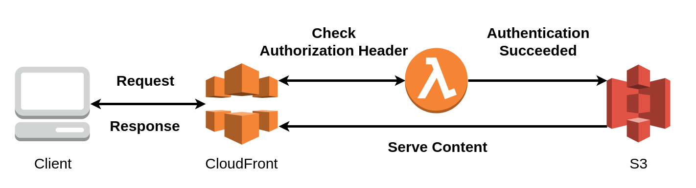

# aws-lambda-edge-basic-auth-terraform



This is a [Terraform](https://www.terraform.io/) module that creates [AWS Lambda@Edge](https://docs.aws.amazon.com/AmazonCloudFront/latest/DeveloperGuide/lambda-at-the-edge.html) resources to protect [CloudFront](https://docs.aws.amazon.com/AmazonCloudFront/latest/DeveloperGuide/Introduction.html) distributions with [Basic Authentication](https://en.wikipedia.org/wiki/Basic_access_authentication).

The purpose of this module is to make it no-brainer to set up AWS resources required to perform Basic Authentication with AWS Lambda@Edge. If you don't want to take care of tedious jobs such as IAM role setup, this is a right module to go with.

The actual code to perform Basic Authentication is derived from [lmakarov/lambda-basic-auth.js](https://gist.github.com/lmakarov/e5984ec16a76548ff2b278c06027f1a4#file-lambda-basic-auth-js).

## Usage

This is a [Terraform module](https://www.terraform.io/docs/modules/index.html). You just need to include the module in one of your Terraform configuration files with some parameters and add [`lambda_function_association` block](https://www.terraform.io/docs/providers/aws/r/cloudfront_distribution.html#lambda-function-association) to your [`aws_cloudfront_distribution` resource](https://www.terraform.io/docs/providers/aws/r/cloudfront_distribution.html). See [examples/](/examples) for complete examples.

```hcl
# If the parent module provider region is not us-east-1, define provider for us-east-1.
#
#provider "aws" {
#  alias  = "us-east-1"
#  region = "us-east-1"
#}

module "basic_auth" {
  source = "github.com/builtinnya/aws-lambda-edge-basic-auth-terraform/module"

  basic_auth_credentials = {
    hashed_username     = "your-hashed-username"
    hashed_username     = "your-hashed_password"
  }

  # All Lambda@Edge functions must be put on us-east-1.
  # If the parent module provider region is not us-east-1, you have to
  # define and pass us-east-1 provider explicitly.
  # See https://www.terraform.io/docs/modules/usage.html#passing-providers-explicitly for detail.
  #
  #providers = {
  #  aws = "aws.us-east-1"
  #}
}

resource "aws_cloudfront_distribution" "your_distribution" {
  # ...

  # Add the following block to associate the Lambda function.
  lambda_function_association {
    event_type   = "viewer-request"
    lambda_arn   = "${module.basic_auth.lambda_arn}"
    include_body = false
  }
}
```

## Inputs

| Name | Description | Type | Default | Required |
|------|-------------|:----:|:-----:|:-----:|
| basic\_auth\_credentials | Credentials for Basic Authentication. Pass a map composed of 'user' and 'hashed_password'. | map | n/a | yes |
| function\_name | Lambda function name | string | `"basicAuth"` | no |

## Outputs

| Name | Description |
|------|-------------|
| lambda\_arn | Lambda function ARN with version |

## Examples

### Minimal

The minimal example is located at [examples/minimal](examples/minimal) . It creates an S3 bucket, an S3 object ([`index.html`](examples/minimal/index.html)), and a CloudFront distribution protected with Basic Authentication, enough to confirm that this module protects resources with Basic Authentication.

#### Building Resources

1. Move to [examples/minimal](examples/minimal) directory.

    ```bash
    $ cd examples/minimal
    ```

2. Copy `terraform.tfvars.example` to `terraform.tfvars` and fill in the values.

    ```bash
    $ cp terraform.tfvars.example terraform.tfvars
    $ # Edit terraform.tfvars with your favorite editor.
    ```

    ```hcl
    aws_access_key = "<your AWS access key>"
    aws_secret_key = "<your AWS secret key>"
    region = "<region>"
    s3_bucket_name = "<S3 bucket name to create>"

    basic_auth_credentials = {
      "hashed_username" = "<SHA256 Hashed Basic Auth Username>"
      "hashed_username" = "<SHA256 Hashed Basic Auth hashed_password>"
    }
    ```

3. Execute the following commands to build resources using Terraform.

    ```bash
    $ terraform init
    $ terraform plan
    $ terraform apply
    ```

If building succeeded, it will show messages like the following:

```bash
Outputs:

url = https://<some-random-string>.cloudfront.net
```

You can access to the URL and check if Basic Authentication works once the CloudFront is ready (it takes some time to be ready.)

#### Destroying Resources

To destroy AWS resources created by the above steps, execute the following commands in [examples/minimal](examples/minimal) directory.

```bash
$ terraform destroy
```

**NOTICE: the above command probably ends up with error. See [Deleting Lambda@Edge Functions and Replicas](https://docs.aws.amazon.com/AmazonCloudFront/latest/DeveloperGuide/lambda-edge-delete-replicas.html) for detail.**

## Development

You just need to install [Docker](https://www.docker.com/) to develop this module.

- Terraform configurations for this module is located at [module/](module/) directory.
- Lambda@Edge function source code is located at [src/basic-auth.js](src/basic-auth.js). It needs to be transpiled by [Babel](https://babeljs.io/) and minified by [UglifyJS](http://lisperator.net/uglifyjs/) before zip-compressed by Terraform.

### Updating Lambda Function Code

If you update the Lambda function source code, you also need to update the function code in the module. It can be done by running:

```bash
$ ./build.sh
```

### Deleting Generated Lambda Function Code

If you want to delete Lambda function code generated by running `./build.sh`, run the following:

```bash
$ ./clean.sh
```

You should rarely have to use the command.

### Generating Inputs and Outputs Documentation

If you add or remove inputs or outputs of this module, you have to update the documentation.

You can generate inputs and ouputs documentation of this module by running:

```bash
$ ./docs.sh
```

It shows markdown table of inputs and outputs, same as included in this README.

### Testing

Tests for the handler is located at [`test/`](test/) directory and executed in `build.sh`.

### Diagrams

Diagrams are located at [`diagrams/`](diagrams/) directory. You can import and edit XML files visually using [draw.io](https://www.draw.io/).

# License

Copyright © 2019 Naoto Yokoyama

Distributed under the MIT license. See the [LICENSE](./LICENSE) file for full details.
